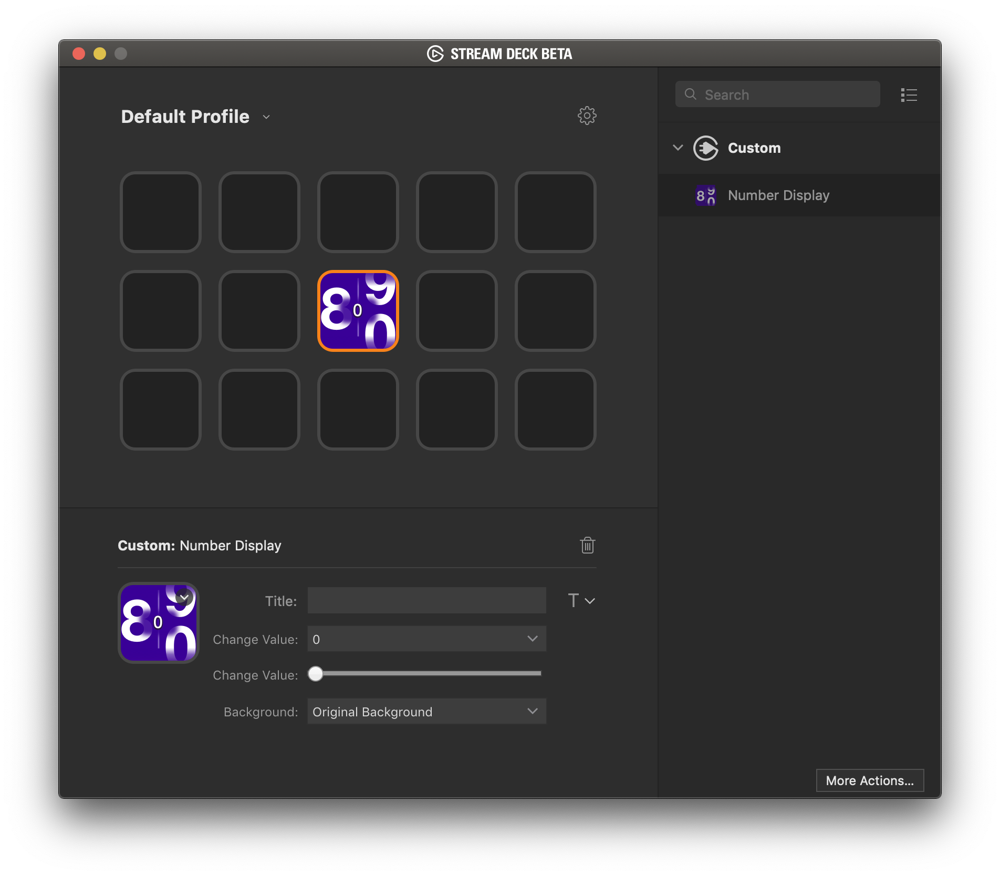

`CommandSender` is a plugin created by BiffMasterZay.

# Description

`CommandSender` is a plugin that allows a user to send messages via websocket to a server on button press/release.

# Features

- code written in Javascript
- cross-platform (macOS, Windows)

# Installation

In the Release folder, you can find the file `com.biffmasterzay.commandsender.streamDeckPlugin`. If you double-click this file on your machine, Stream Deck will install the plugin.

# Source code

The Sources folder contains the source code of the plugin.
